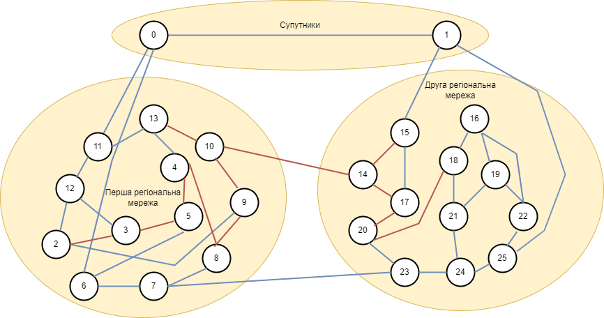
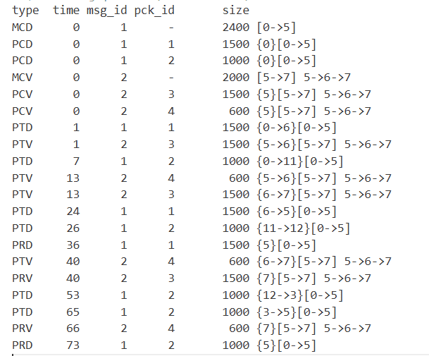
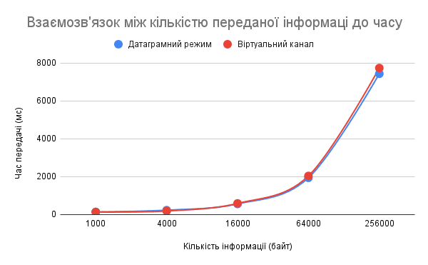
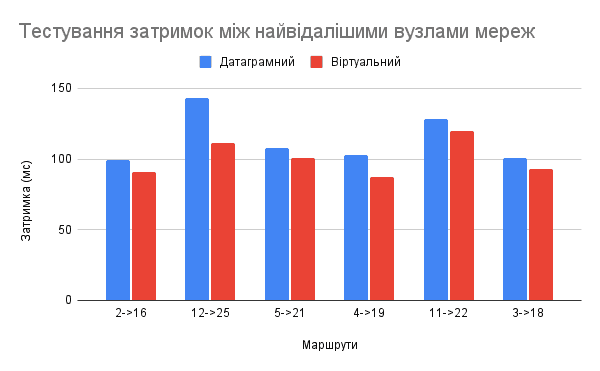
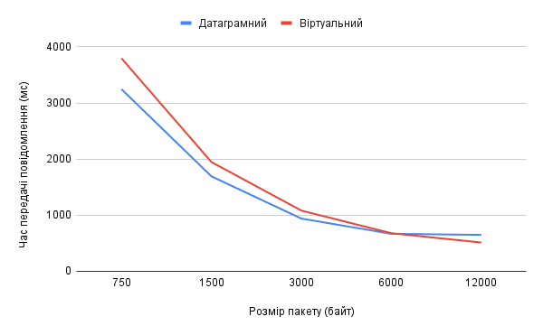
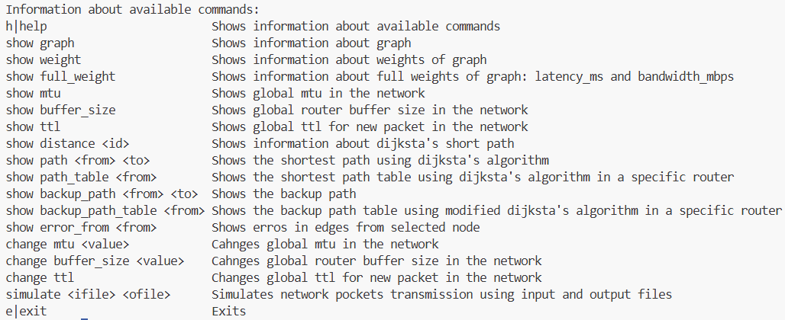

# Computer Network Modeling – Routing Simulation System

### Abstract

This project presents a simulation system for analyzing **packet transmission in heterogeneous computer networks**.
The system models routing behavior using a **modified Dijkstra algorithm** that supports alternative path discovery and probabilistic routing decisions.

The simulator enables evaluation of:
- transmission delay
- packet delivery probability
- optimal packet size

Experimental results demonstrate how routing strategies and packet fragmentation influence **network efficiency and reliability**.

### 1. Introduction

Modern computer networks must balance **efficiency, reliability, and adaptability** under varying conditions.
This project explores how routing strategies and packet-level decisions affect overall network performance.

The work was initially developed as coursework, then extended to include:
- alternative routing strategies
- probabilistic decision models
- experimental evaluation of network behavior

### 2. Core Idea

The system extends the classical shortest-path approach:

1. Compute shortest path using Dijkstra
2. Temporarily remove edges of the primary path
3. Compute an alternative path
4. Use probabilistic selection between paths during transmission

This approach introduces:
- fault tolerance
- load distribution
- more realistic routing behavior

### 3. System Architecture

**Components**:

- **Graph / Node / Edge**
Network representation with weighted links
- **PathAlgorithm**
Modified Dijkstra implementation
- **Packet / Message**
Handles fragmentation and reconstruction
- **Simulation Engine**
Event-driven system using priority queues
- **Controller**
CLI interface for running simulations


### 4. Network Model



**Model Characteristics:**

- Two interconnected regional networks
- ≥12 nodes per region
- Mixed communication types:
    - standard links
    - satellite connections (higher delay)

The model simulates **heterogeneous environments**, where:
- latency varies significantly
- routing decisions affect performance

### 5. Simulation Design



**Features:**

- Packet fragmentation (MTU-based)
- Router and edge buffering
- Event-driven scheduling
- Randomized traffic generation

### 6. Routing Modes

**Datagram Mode**

- Each packet routed independently
- Uses probabilistic path selection
- Higher adaptability

**Virtual Channel Mode**

- Single fixed path for entire message
- Lower overhead
- Less flexible under congestion

### 7. Experiments

##### Experiment 1: Packet Size vs Transmission Delay

**Goal:** Determine optimal packet size
- Small packets → high overhead
- Large packets → increased retransmission cost



##### Experiment 2: Routing Strategy Comparison

**Goal:** Compare Datagram vs Virtual Channel

Metrics:
- delivery time
- packet loss probability





##### Experiment 3: Network Load Behavior

**Goal:** Analyze congestion effects
Increased traffic → longer delays
alternative paths reduce bottlenecks



### 8. Results & Insights

Key observations:

- **Alternative routing improves robustness**
  The modified Dijkstra approach reduces dependency on a single path
- **Packet size has a non-linear effect**
  There exists an optimal range balancing overhead and efficiency
- **Datagram mode is more adaptive**
  Performs better under dynamic or congested conditions
- **Virtual channel mode is more stable**
  Suitable for predictable, low-load environments

### 9. Research Contribution

This project demonstrates:
- practical implementation of routing algorithm modification
- simulation-based evaluation of network behavior
- ability to connect theory (algorithms) with system-level performance

It reflects an interest in:
- distributed systems
- network optimization
- performance modeling


### 10. How to Run and Use
```
make run
```




### 11. Project Structure

```
.
├── Makefile
├── README.md
├── bin
│   ├── App.exe
│   ├── Controller.o
│   ├── Global.o
│   ├── Packet.o
│   ├── PathAlgorithms.o
│   ├── Simulation.o
│   └── main.o
├── course_project.pdf
├── img
│   ├── commands.png
│   ├── graph.png
│   ├── graph2_.png
│   ├── graph3_.png
│   ├── graph4_.png
│   └── simo_file.png
├── src
│   ├── Controller.cpp
│   ├── Controller.hpp
│   ├── Global.cpp
│   ├── Global.hpp
│   ├── MessageStats.hpp
│   ├── Packet.cpp
│   ├── Packet.hpp
│   ├── PathAlgorithms.cpp
│   ├── PathAlgorithms.hpp
│   ├── Simulation.cpp
│   ├── Simulation.hpp
│   └── main.cpp
├── test.simc
├── test.simo
└── test2.simc
```

### Note

This project represents an early step toward research in:
- computer networks
- distributed systems
- performance analysis